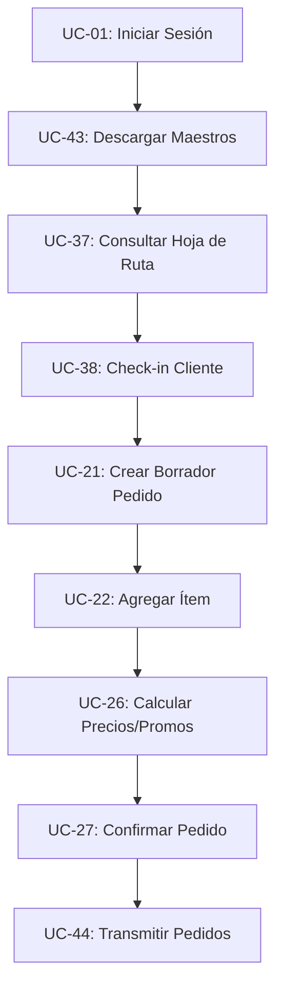

# Casos de Uso del Sistema Tomapedido: APP La Campiña

Este documento contiene la matriz completa y el análisis detallado de 50 Casos de Uso (UC) indispensables para la correcta implementación y operación del sistema digital Tomapedido.

---

## 1. Clasificación General de Casos de Uso

| ID | Caso de Uso | Actor Principal | Prioridad | Aplica Offline |
|---|---|---|---|---|
| **M1** | **Autenticación y Seguridad** | | | |
| UC-01 | Iniciar Sesión en la App Móvil | Preventista / Admin / Bodega | Alta | No |
| UC-02 | Cerrar Sesión Segura | Todos los Roles | Media | Sí |
| UC-03 | Cambio de Contraseña de Usuario | Todos los Roles | Media | No |
| UC-04 | Bloqueo de Cuenta por Intentos Fallidos | Sistema | Alta | No |
| UC-05 | Renovación Expresa de Sesión (Token) | Sistema | Baja | No |
| UC-06 | Auditoría de Acceso (Registro de Logins) | Sistema | Media | No |
| **M2** | **Gestión de Clientes** | | | |
| UC-07 | Consultar Lista de Clientes de la Ruta | Preventista | Alta | Sí |
| UC-08 | Buscar Cliente por Nombre/Código/NIT | Preventista | Alta | Sí |
| UC-09 | Visualizar Ubicación de Cliente en Mapa | Preventista | Media | Sí |
| UC-10 | Registrar Nuevo Cliente en Campo (Prospecto) | Preventista | Media | Sí |
| UC-11 | Consultar Saldo y Cartera del Cliente | Preventista | Alta | Sí (Caché) |
| UC-12 | Consultar Historial de Compras del Cliente | Preventista | Media | Sí (Caché) |
| UC-13 | Actualizar Coordenadas GPS del Cliente | Preventista | Alta | Sí |
| UC-14 | Bloqueo Administrativo de Cliente Moroso | Administrador / Sistema | Alta | No |
| **M3** | **Inventarios y Catálogo** | | | |
| UC-15 | Consultar Stock de Productos en Tiempo Real | Preventista / Bodega | Alta | Sí (Caché) |
| UC-16 | Buscar Producto por Código de Barras / SKU | Preventista / Bodega | Alta | Sí |
| UC-17 | Buscar Producto por Categoría / Subcategoría | Preventista | Media | Sí |
| UC-18 | Visualizar Ficha Técnica del Producto | Preventista | Baja | Sí |
| UC-19 | Alerta de Stock Crítico (Bajo Minimo) | Sistema | Media | No |
| UC-20 | Reserva Temporal de Stock al Crear Pedido | Sistema | Alta | No |
| **M4** | **Captura y Gestión de Pedidos** | | | |
| UC-21 | Crear Borrador de Pedido | Preventista | Alta | Sí |
| UC-22 | Agregar Ítem al Pedido con Unidad de Venta | Preventista | Alta | Sí |
| UC-23 | Modificar Cantidades de un Ítem en Carrito | Preventista | Alta | Sí |
| UC-24 | Eliminar Ítem del Carrito | Preventista | Alta | Sí |
| UC-25 | Registrar Notas Especiales de Entrega | Preventista | Media | Sí |
| UC-26 | Calcular Precios, Descuentos e Impuestos | Sistema | Alta | Sí |
| UC-27 | Confirmar y Guardar Pedido Pendiente | Preventista | Alta | Sí |
| UC-28 | Cancelar Pedido No Transmitido | Preventista | Alta | Sí |
| UC-29 | Consultar Pedidos Enviados del Día | Preventista | Media | Sí |
| UC-30 | Firma Digital de Aceptación del Cliente | Preventista | Media | Sí |
| **M5** | **Motor de Promociones y Descuentos** | | | |
| UC-31 | Aplicar Descuento Automático por Volumen | Sistema | Alta | Sí |
| UC-32 | Canjear Combo/Bundle Promocional Especial | Preventista / Sistema | Alta | Sí |
| UC-33 | Agregar Obsequio (Bonificación) al Pedido | Sistema | Alta | Sí |
| UC-34 | Aplicar Descuento Comercial Manual (Porcentaje) | Preventista (Supervisor) | Media | Sí |
| UC-35 | Configurar Promoción Programada | Administrador | Alta | No |
| UC-36 | Validar Límite de Promociones (Stock de Bonos) | Sistema | Media | No |
| **M6** | **Rutas y Georreferenciación** | | | |
| UC-37 | Consultar Hoja de Ruta Asignada del Día | Preventista | Alta | Sí |
| UC-38 | Check-in en Punto de Venta (Inicio Visita) | Preventista | Alta | Sí (GPS) |
| UC-39 | Registrar Visita No Efectiva (Motivo de No Venta) | Preventista | Alta | Sí |
| UC-40 | Check-out de Punto de Venta (Fin Visita) | Preventista | Alta | Sí (GPS) |
| UC-41 | Ver Avance de Ruta en Dashboard de Supervisor | Supervisor | Alta | No |
| UC-42 | Reordenamiento Óptimo de Puntos en Ruta | Sistema | Media | Sí |
| **M7** | **Sincronización y Transmisión** | | | |
| UC-43 | Descargar Datos Maestros (Clientes, SKU, Promos) | Preventista | Alta | No |
| UC-44 | Transmitir Pedidos Pendientes al Servidor | Preventista | Alta | No |
| UC-45 | Sincronización Automática en Segundo Plano | Sistema | Alta | No |
| UC-46 | Resolución de Conflictos de Datos Sincronizados | Sistema / Admin | Media | No |
| **M8** | **Despacho, Reportes e Integraciones** | | | |
| UC-47 | Consolidación de Pedidos por Ruta para Picking | Bodega | Alta | No |
| UC-48 | Registrar Pedido como Despachado (Salida Bodega) | Bodega | Alta | No |
| UC-49 | Generar Reporte de Ventas por Preventista | Administrador | Media | No |
| UC-50 | Consultar Registro de Logs de Auditoría | Administrador | Media | No |

---

## 2. Análisis Detallado de Casos de Uso Clave

### UC-22: Agregar Ítem al Pedido con Unidad de Venta
* **Descripción:** Permite al preventista añadir un producto al carrito de compras especificando si vende por unidad elemental o embalaje colectivo (caja/paca), ajustando el stock teórico.
* **Precondición:** El preventista inició una visita al cliente (UC-38) y el producto tiene stock disponible mayor a cero (UC-15).
* **Flujo Básico:**
  1. El preventista selecciona un producto del catálogo.
  2. Selecciona la unidad de medida (ej. Caja).
  3. Ingresa la cantidad deseada.
  4. El sistema valida la disponibilidad física de inventario.
  5. Se añade el ítem al carrito calculando precio base y promociones asociadas (UC-31/UC-32).
* **Postcondición:** El subtotal y peso total del carrito de compras se actualiza inmediatamente en pantalla.

### UC-32: Canjear Combo/Bundle Promocional Especial
* **Descripción:** Aplica de forma automática o sugerida la estructura de bonificación configurada cuando un cliente cumple con una mezcla específica de productos (ej. 5 cajas de Gaseosa + 2 pacas de Agua da derecho a 1 paca de Agua gratis).
* **Precondición:** Se ha configurado una promoción activa (UC-35).
* **Flujo Básico:**
  1. El preventista agrega los productos gatillo al carrito de compras.
  2. Al validar el pedido (UC-26), el motor evalúa las reglas.
  3. Se añade automáticamente el producto bonificado con valor unitario $0 y una etiqueta identificadora de "Bonificación".
  4. Se muestra un banner descriptivo del beneficio en la UI.
* **Postcondición:** El pedido registra los ítems del combo y actualiza el subtotal neto sin alterar los costos reales del obsequio.

### UC-39: Registrar Visita No Efectiva (Motivo de No Venta)
* **Descripción:** Registra las visitas a clientes de la ruta que no resultaron en pedidos comerciales, lo que es vital para la analítica de efectividad de preventa.
* **Precondición:** El preventista realizó Check-in en el cliente (UC-38).
* **Flujo Básico:**
  1. El preventista hace clic en "Registrar No Compra".
  2. Selecciona un motivo de una lista predefinida:
     - Negocio cerrado
     - Cliente sin liquidez (sin dinero)
     - Inventario completo (no necesita)
     - Precios altos / competencia
     - Dueño ausente
  3. Añade una nota descriptiva u opcionalmente toma una fotografía del local.
  4. Confirma el registro.
* **Postcondición:** Se realiza el Check-out automático de la visita (UC-40) y el cliente queda marcado en la ruta del día con estado "Visita No Efectiva".

### UC-44: Transmitir Pedidos Pendientes al Servidor
* **Descripción:** Envía de forma masiva o individual los pedidos tomados en modo sin conexión (offline) una vez que el dispositivo móvil recupera acceso a internet.
* **Precondición:** Dispositivo con conectividad activa a internet y pedidos en cola local de despacho.
* **Flujo Básico:**
  1. El preventista pulsa el botón "Sincronizar Pedidos".
  2. El sistema empaqueta los pedidos locales en formato JSON.
  3. Envía una petición POST segura a la API `/api/orders/sync`.
  4. El servidor valida la integridad de cada pedido (estructura, existencia de clientes, stock remanente).
  5. El servidor confirma la recepción y responde con el ID asignado a cada pedido.
  6. La aplicación local elimina o marca los pedidos locales como "Transmitidos".
* **Postcondición:** Los pedidos ingresan a la cola de preparación en bodega.

---

## 3. Análisis de Dependencias y Requerimientos de Seguridad

### Gobernanza y Seguridad de los Casos de Uso
1. **Acceso Restringido (RBAC):** Casos como `UC-14` (Bloqueo de Clientes) o `UC-35` (Configuración de Promociones) requieren permisos estrictos de administrador. Los preventistas solo tienen acceso a visualización y captura de transacciones.
2. **Firmas y Georreferenciación Obligatorias:** Para evitar "visitas fantasma" (preventistas que reportan visitas sin ir físicamente), el sistema valida mediante geovallas (geofencing) que las coordenadas del Check-in (`UC-38`) y Check-out (`UC-40`) coincidan con un radio de 50 metros del punto registrado del cliente.
3. **Resiliencia de Datos Offline:** Todos los casos relacionados con la toma comercial (UC-07 a UC-13, UC-15 a UC-18, y UC-21 a UC-34) están diseñados bajo la premisa **Offline-First**, utilizando almacenamiento local seguro cifrado en el dispositivo, sincronizando automáticamente tan pronto retorne el canal de datos.
