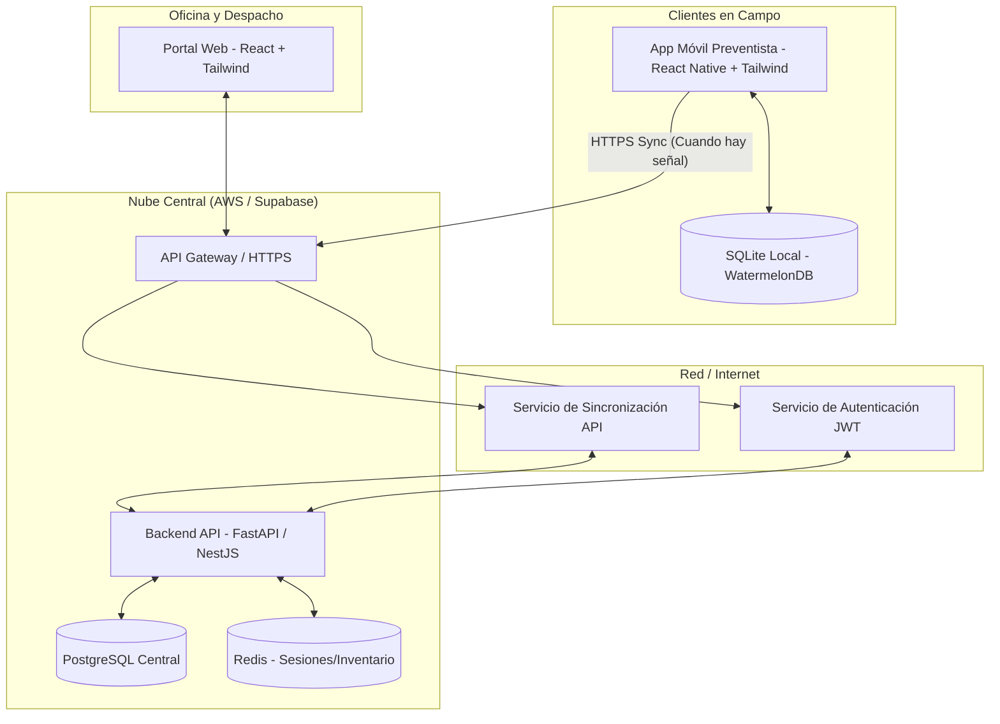

# TDD-01: Arquitectura y Datos - Sistema Tomapedido La Campiña

Este Documento de Diseño Técnico (TDD) define el stack tecnológico, la arquitectura física/lógica, la estructura del proyecto y el modelo relacional de datos para el módulo de preventa y despacho.

---

## 1. Definición del Stack Tecnológico

El sistema debe operar de manera híbrida: **Offline-First** para los preventistas en la calle y **Cloud Native** en tiempo real para bodega y supervisores en la oficina.

| Capa | Tecnología Recomendada | Justificación |
|---|---|---|
| **App Móvil (Preventistas)** | React Native + Expo | Multiplataforma nativo (Android/iOS) con alto rendimiento. |
| **UI Framework (Móvil)** | NativeWind (Tailwind CSS para React Native) | **Obligatorio:** Diseño moderno, responsivo y consistente con utilidades rápidas. |
| **Almacenamiento Local** | SQLite (vía Expo SQLite) + WatermelonDB | Permite almacenamiento offline rápido y sincronización reactiva bidireccional. |
| **Frontend Web (Oficina)** | React + Vite + TypeScript | SPA rápida para bodega y visualización gerencial de KPIs. |
| **UI Framework (Web)** | Tailwind CSS + Shadcn UI | Interfaz minimalista, limpia, moderna y altamente interactiva. |
| **Backend API** | Node.js (NestJS) o Python (FastAPI) | Procesamiento asíncrono ágil, ideal para colas de sincronización e integraciones. |
| **Base de Datos Central** | PostgreSQL | Robusta, con soporte para consultas relacionales complejas y datos JSON. |
| **Despliegue y Hosting** | AWS (ECS / RDS) o Supabase | Arquitectura escalable basada en la nube con API expuesta por HTTPS. |

---

## 2. Arquitectura de Alto Nivel

El siguiente diagrama detalla la interacción entre la app móvil offline-first, el portal web de supervisores, las colas de sincronización del backend y la base de datos central en la nube.



---

## 3. Estructura de Carpetas del Proyecto (Monorepo)

Se propone una estructura de monorepo organizada para separar la aplicación móvil de preventa, el portal web del supervisor y el backend compartido.

```text
la-campina-monorepo/
├── apps/
│   ├── mobile/                  # Aplicación móvil React Native (Expo)
│   │   ├── src/
│   │   │   ├── components/      # Componentes UI reusables (Tailwind)
│   │   │   ├── database/        # Esquemas locales de SQLite
│   │   │   ├── hooks/           # Manejadores de sincronización y GPS
│   │   │   ├── screens/         # Vistas de preventa, catálogo y ruta
│   │   │   └── services/        # Cliente API para sincronización
│   │   └── package.json
│   │
│   ├── web-dashboard/           # Portal administrativo y de bodega (Vite + React)
│   │   ├── src/
│   │   │   ├── components/      # Tarjetas, gráficas (Tailwind + Recharts)
│   │   │   ├── views/           # OEE Vendedores, OTIF Camiones, Despacho
│   │   │   └── services/        # Cliente API
│   │   └── package.json
│   │
│   └── backend-api/             # Servidor API central
│       ├── src/
│       │   ├── auth/            # Seguridad y Roles (RBAC)
│       │   ├── sync/            # Lógica de sincronización offline-first
│       │   ├── orders/          # Gestión de pedidos y stock
│       │   ├── metrics/         # Cálculo automático de OEE y OTIF
│       │   └── models/          # Entidades de base de datos
│       └── package.json
│
├── packages/
│   └── shared-types/            # Tipos e interfaces comunes en TypeScript
└── package.json
```

---

## 4. Esquema de Base de Datos (Modelo Relacional)

Diseño SQL detallado optimizado para PostgreSQL. Integra el control de usuarios, cartera, promociones, cálculo de **OEE** del vendedor y métricas **OTIF** para las entregas.

```sql
-- 1. Roles y Usuarios
CREATE TABLE roles (
    id SERIAL PRIMARY KEY,
    name VARCHAR(50) UNIQUE NOT NULL,
    description TEXT
);

CREATE TABLE users (
    id SERIAL PRIMARY KEY,
    username VARCHAR(50) UNIQUE NOT NULL,
    password_hash VARCHAR(255) NOT NULL,
    first_name VARCHAR(100) NOT NULL,
    last_name VARCHAR(100),
    role_id INTEGER REFERENCES roles(id),
    is_active BOOLEAN DEFAULT TRUE,
    created_at TIMESTAMP WITH TIME ZONE DEFAULT CURRENT_TIMESTAMP
);

-- 2. Clientes y Crédito
CREATE TABLE clients (
    id SERIAL PRIMARY KEY,
    nit_cedula VARCHAR(20) UNIQUE NOT NULL,
    business_name VARCHAR(150) NOT NULL,
    owner_name VARCHAR(150),
    address VARCHAR(255) NOT NULL,
    latitude DECIMAL(10, 8),
    longitude DECIMAL(11, 8),
    phone VARCHAR(20),
    credit_limit DECIMAL(12, 2) DEFAULT 0.00,
    current_balance DECIMAL(12, 2) DEFAULT 0.00, -- Cuentas por cobrar
    is_active BOOLEAN DEFAULT TRUE,
    created_at TIMESTAMP WITH TIME ZONE DEFAULT CURRENT_TIMESTAMP
);

-- 3. Catálogo e Inventario
CREATE TABLE products (
    id SERIAL PRIMARY KEY,
    sku VARCHAR(50) UNIQUE NOT NULL,
    name VARCHAR(150) NOT NULL,
    description TEXT,
    price DECIMAL(10, 2) NOT NULL,
    stock INTEGER NOT NULL CHECK (stock >= 0),
    unit_of_measure VARCHAR(20) DEFAULT 'unidad',
    is_active BOOLEAN DEFAULT TRUE
);

-- 4. Motor de Promociones
CREATE TABLE promotions (
    id SERIAL PRIMARY KEY,
    name VARCHAR(100) NOT NULL,
    description TEXT,
    promo_type VARCHAR(30) NOT NULL, -- 'discount_vol', 'bundle', 'gift'
    start_date DATE NOT NULL,
    end_date DATE NOT NULL,
    is_active BOOLEAN DEFAULT TRUE,
    rules_json JSONB NOT NULL -- Define condiciones y beneficios
);

-- 5. Pedidos comerciales
CREATE TABLE orders (
    id SERIAL PRIMARY KEY,
    client_id INTEGER NOT NULL REFERENCES clients(id),
    seller_id INTEGER NOT NULL REFERENCES users(id),
    order_date TIMESTAMP WITH TIME ZONE DEFAULT CURRENT_TIMESTAMP,
    total_amount DECIMAL(12, 2) NOT NULL,
    status VARCHAR(30) DEFAULT 'PENDIENTE', -- 'PENDIENTE', 'APROBADO', 'DESPACHADO', 'ENTREGADO', 'RECHAZADO'
    signature_url VARCHAR(255),
    gps_latitude DECIMAL(10, 8),
    gps_longitude DECIMAL(11, 8),
    sync_at TIMESTAMP WITH TIME ZONE
);

CREATE TABLE order_items (
    id SERIAL PRIMARY KEY,
    order_id INTEGER NOT NULL REFERENCES orders(id) ON DELETE CASCADE,
    product_id INTEGER NOT NULL REFERENCES products(id),
    quantity INTEGER NOT NULL CHECK (quantity > 0),
    price_unit DECIMAL(10, 2) NOT NULL,
    discount_applied DECIMAL(10, 2) DEFAULT 0.00,
    is_gift BOOLEAN DEFAULT FALSE
);

-- 6. Logística, Despacho y Métrica OTIF
CREATE TABLE trucks (
    id SERIAL PRIMARY KEY,
    plate VARCHAR(15) UNIQUE NOT NULL,
    driver_name VARCHAR(150) NOT NULL,
    capacity_kg DECIMAL(10, 2) NOT NULL,
    is_active BOOLEAN DEFAULT TRUE
);

CREATE TABLE dispatches (
    id SERIAL PRIMARY KEY,
    truck_id INTEGER NOT NULL REFERENCES trucks(id),
    dispatch_date DATE NOT NULL,
    route_name VARCHAR(100),
    status VARCHAR(30) DEFAULT 'EN_BODEGA' -- 'EN_BODEGA', 'EN_RUTA', 'FINALIZADO'
);

CREATE TABLE delivery_details (
    id SERIAL PRIMARY KEY,
    dispatch_id INTEGER NOT NULL REFERENCES dispatches(id),
    order_id INTEGER NOT NULL REFERENCES orders(id),
    sequence_order INTEGER NOT NULL,
    promised_delivery_time TIMESTAMP WITH TIME ZONE,
    actual_delivery_time TIMESTAMP WITH TIME ZONE,
    is_delivered_on_time BOOLEAN,
    is_delivered_in_full BOOLEAN,
    rejection_reason VARCHAR(255), -- Si no es In-Full, por qué.
    otif_score DECIMAL(5, 2) -- (On-Time * In-Full)
);

-- 7. Desempeño OEE de Vendedores
CREATE TABLE seller_oee_metrics (
    id SERIAL PRIMARY KEY,
    seller_id INTEGER NOT NULL REFERENCES users(id),
    work_date DATE NOT NULL,
    scheduled_visits INTEGER NOT NULL,
    actual_visits INTEGER NOT NULL,
    effective_sales INTEGER NOT NULL, -- Clientes que compraron
    total_sales_value DECIMAL(12, 2) DEFAULT 0.00,
    availability_score DECIMAL(5, 2), -- Tiempos en ruta vs planificado
    performance_score DECIMAL(5, 2),  -- Eficiencia de visitas (actual / scheduled)
    quality_score DECIMAL(5, 2),      -- Ventas efectivas / visitas reales (Efectividad)
    overall_oee DECIMAL(5, 2),        -- (Availability * Performance * Quality)
    created_at TIMESTAMP WITH TIME ZONE DEFAULT CURRENT_TIMESTAMP
);
CREATE UNIQUE INDEX idx_seller_oee_date ON seller_oee_metrics(seller_id, work_date);
