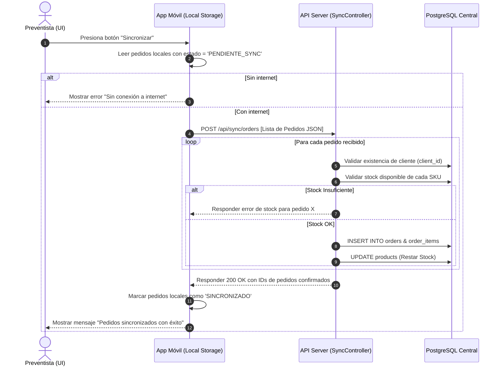
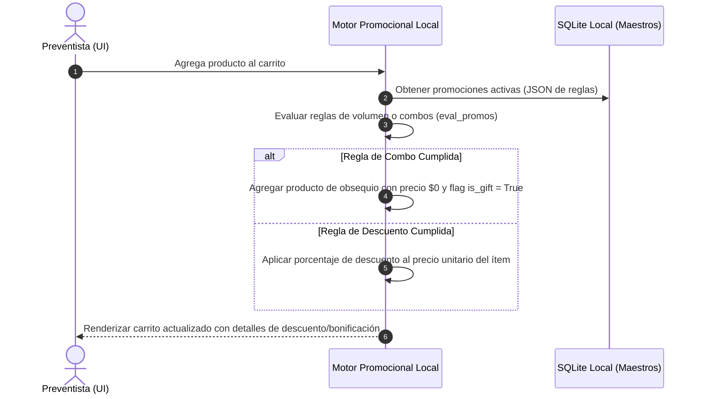

# TDD-02: Flujos y Lógica de Negocio - Sistema Tomapedido La Campiña

Este documento de diseño técnico (TDD) define el comportamiento de los flujos core del sistema, modelando las interacciones y el pseudocódigo estructurado para el desarrollo del backend y frontend.

---

## 1. Diagramas de Flujo de Información (Secuencia)

### Flujo 1: Sincronización de Pedidos Offline a Online
Este flujo ilustra cómo la aplicación móvil detecta la conexión y transmite los pedidos locales en cola hacia la base de datos central de forma segura.



### Flujo 2: Cálculo de Promociones en Carrito
Procesa las reglas comerciales dinámicas (ej. bonificaciones y descuentos automáticos) en el momento en que se edita el carrito de compras.



---

## 2. Mapeo de Archivos Clave

Referenciando la estructura de carpetas definida en el **TDD-01**, los archivos involucrados en la implementación de estos flujos lógicos son:

1. **`apps/mobile/src/database/sync.ts`**: Manejador del almacenamiento SQLite móvil para colas de sincronización.
2. **`apps/backend-api/src/sync/sync.service.ts`**: Servicio del servidor para validación masiva e inserción atómica de pedidos.
3. **`apps/mobile/src/services/promoEngine.ts`**: Motor local JavaScript/TypeScript que evalúa las promociones cargadas de forma local (Offline-first).
4. **`apps/backend-api/src/orders/dispatch.service.ts`**: Algoritmo para consolidar pedidos por ruta física y preparar órdenes de cargue en bodega.
5. **`apps/mobile/src/hooks/useRouteTracker.ts`**: Hook de React Native para tracking de geovallas (check-in / check-out GPS) del preventista.
6. **`apps/backend-api/src/metrics/kpi.service.ts`**: Calculadora de métricas operacionales de OEE (vendedor) y OTIF (vehículo).

---

## 3. Pseudocódigo Estructurado

### A. Sincronización de Pedidos en Servidor (`sync.service.ts`)
```typescript
interface OrderItemInput {
  productId: number;
  quantity: number;
  priceUnit: number;
  discountApplied: number;
}

interface OrderInput {
  localId: string;
  clientId: number;
  sellerId: number;
  totalAmount: number;
  latitude: number;
  longitude: number;
  items: OrderItemInput[];
}

class SyncService {
  async syncOrders(orders: OrderInput[], dbConnection: Database): Promise<SyncResult> {
    const results = { successfulIds: [], errors: [] };

    for (const order of orders) {
      // Iniciar una transacción de base de datos para asegurar atomicidad
      const tx = await dbConnection.beginTransaction();
      try {
        // 1. Validar crédito del cliente
        const client = await tx.query("SELECT credit_limit, current_balance FROM clients WHERE id = $1", [order.clientId]);
        const availableCredit = client.credit_limit - client.current_balance;
        if (order.totalAmount > availableCredit) {
          throw new Error(`Crédito insuficiente. Disponible: ${availableCredit}`);
        }

        // 2. Validar stock de cada ítem
        for (const item of order.items) {
          const product = await tx.query("SELECT stock, name FROM products WHERE id = $1 FOR UPDATE", [item.productId]);
          if (product.stock < item.quantity) {
            throw new Error(`Stock insuficiente para ${product.name}. Disponible: ${product.stock}`);
          }
        }

        // 3. Crear pedido central
        const newOrder = await tx.query(
          `INSERT INTO orders (client_id, seller_id, total_amount, gps_latitude, gps_longitude, status)
           VALUES ($1, $2, $3, $4, $5, 'APROBADO') RETURNING id`,
          [order.clientId, order.sellerId, order.totalAmount, order.latitude, order.longitude]
        );

        // 4. Insertar ítems y descontar stock
        for (const item of order.items) {
          await tx.query(
            `INSERT INTO order_items (order_id, product_id, quantity, price_unit, discount_applied)
             VALUES ($1, $2, $3, $4, $5)`,
            [newOrder.id, item.productId, item.quantity, item.priceUnit, item.discountApplied]
          );

          await tx.query(
            "UPDATE products SET stock = stock - $1 WHERE id = $2",
            [item.quantity, item.productId]
          );
        }

        // 5. Confirmar transacción
        await tx.commit();
        results.successfulIds.push(order.localId);

      } catch (err: any) {
        await tx.rollback();
        results.errors.push({ localId: order.localId, reason: err.message });
      }
    }
    return results;
  }
}
```

### B. Motor Promocional en App Móvil (`promoEngine.ts`)
```typescript
interface CartItem {
  productId: number;
  sku: string;
  price: number;
  quantity: number;
  isGift?: boolean;
}

interface PromotionRule {
  id: number;
  promoType: 'discount_vol' | 'bundle' | 'gift';
  triggerSku: string;
  triggerQty: number;
  benefitSku?: string;
  benefitQty?: number;
  benefitDiscount?: number; // Ej: 0.50 (50% de descuento)
}

class PromoEngine {
  static evaluatePromotions(cart: CartItem[], activePromos: PromotionRule[]): CartItem[] {
    // 1. Clonar el carrito para evitar efectos colaterales (remover obsequios previos)
    let updatedCart = cart.filter(item => !item.isGift);

    for (const rule of activePromos) {
      // Buscar si el producto que activa la promoción está en el carrito
      const triggerItem = updatedCart.find(item => item.sku === rule.triggerSku);
      
      if (triggerItem && triggerItem.quantity >= rule.triggerQty) {
        const triggersCount = Math.floor(triggerItem.quantity / rule.triggerQty);

        if (rule.promoType === 'gift' && rule.benefitSku && rule.benefitQty) {
          // Agregar producto bonificado (Gratis)
          updatedCart.push({
            productId: 0, // ID dummy o el real mapeado
            sku: rule.benefitSku,
            price: 0, // Precio 0 por ser obsequio
            quantity: rule.benefitQty * triggersCount,
            isGift: true
          });
        } 
        else if (rule.promoType === 'discount_vol' && rule.benefitDiscount) {
          // Aplicar descuento al producto gatillo
          triggerItem.price = triggerItem.price * (1 - rule.benefitDiscount);
        }
      }
    }
    return updatedCart;
  }
}
```

### C. Consolidado de Carga para Picking (`dispatch.service.ts`)
```python
class DispatchService:
    def consolidate_route_picking(self, dispatch_id: int, db_connection) -> dict:
        """
        Consolida la carga sumando las unidades de cada SKU requeridas para una ruta específica.
        Esto permite a la bodega armar la carga total del camión sin leer orden por orden.
        """
        query = """
            SELECT p.sku, p.name, SUM(oi.quantity) as total_qty, p.unit_of_measure
            FROM delivery_details dd
            JOIN orders o ON dd.order_id = o.id
            JOIN order_items oi ON o.id = oi.order_id
            JOIN products p ON oi.product_id = p.id
            WHERE dd.dispatch_id = %s AND o.status = 'APROBADO'
            GROUP BY p.sku, p.name, p.unit_of_measure
        """
        raw_results = db_connection.execute(query, [dispatch_id])
        
        picking_list = []
        for row in raw_results:
            picking_list.append({
                "sku": row["sku"],
                "product_name": row["name"],
                "quantity": int(row["total_qty"]),
                "unit": row["unit_of_measure"]
            })
            
        return {
            "dispatch_id": dispatch_id,
            "total_items": len(picking_list),
            "picking_list": picking_list
        }
```
